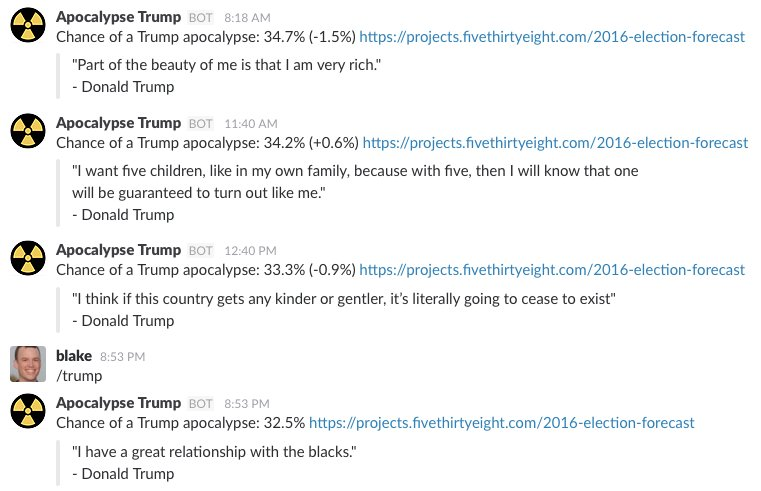

Apocalypse Trump: Slack Bot
===========================

Are you obsessed with the 2016 US presidential election? Add the 
[Apocalypse Trump Bot](https://apocalypse.blakecaldwell.net) to one of your 
[Slack](https://slack.com) channels, and be notified every time 
[FiveThirtyEight's predictions](https://projects.fivethirtyeight.com/2016-election-forecast/) 
change, along with a fun Donald Trump quote.

You can also use the `/trump` slash command to get an update and quote right away.

Note: Nothing about this is endorsed by FiveThirtyEight.

Add to Your Slack Channel
-------------------------

There's no website for the bot right now, so [this link](https://apocalypse.blakecaldwell.net) 
will take you to the signup process.

Privacy
-------

The bot does not have the capability to see your Slack messages. It only sees `/trump`
when you type it. It uses [OAuth 2.0](https://api.slack.com/docs/oauth) for authentication,
which you can revoke at any time from Slack.

Screenshot
----------

Code
----

This repository contains the code for the Slack bot. It currently uses two main 
Slack API features: [incoming webhooks](https://api.slack.com/incoming-webhooks) and 
[slash commands](https://api.slack.com/slash-commands). Incoming webhooks are
used to deliver messages to your channel as soon as the bot notices a change
to FiveThirtyEight's prediction. The bot also handles the `/trump` slash command,
returning the most recently read election prediction, along with a quote.

For now, and until it proves insufficient, the data store is just a JSON-marshalled
version of the "tokens" map in the 
[Server struct](https://github.com/wblakecaldwell/apocalypse-trump-2016/blob/master/cmd/apocalypse/server.go).
